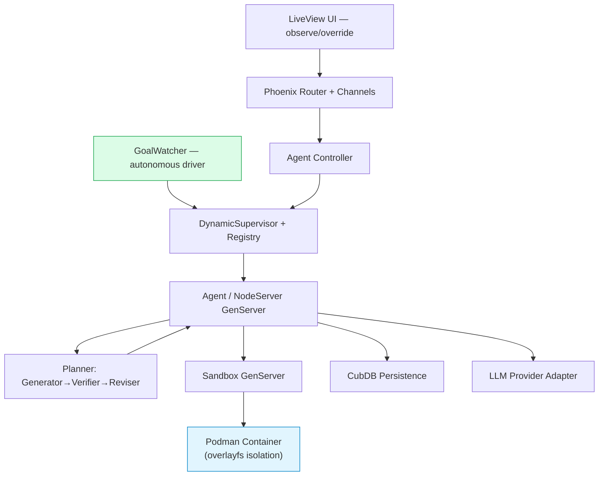

# 🪴 Orchid

[](https://elixir-lang.org)
[](https://github.com/phoenixframework/phoenix_live_view)
[](https://podman.io)

**A system for Autonomous Goal Pursuit**

Orchid runs self-directed teams of LLM agents that **research, build, and operate complex systems on their own** — no human in the loop. You give it a goal and a way to measure success; Orchid plans, executes, verifies, recovers from failure, and keeps going until the goal is met. Strong container isolation, persistent goals, structured object editing, and a real-time dashboard let you *watch* the work — but the system never waits on you to proceed.

---


*(Replace this placeholder with a real screenshot or 10-second GIF of the dashboard after you record one!)*

## ✨ What Orchid does

- **Autonomous by default** — Declare a goal + a success metric and walk away. Orchid decomposes, executes, self-reviews, and re-plans on failure with **zero required human approvals**. Human oversight is available, never mandatory.
- **Autonomous research** — Forms hypotheses, runs experiments in sandboxes, measures results against a metric, and keeps only what moves the number — a closed optimization loop, not a one-shot answer.
- **Autonomous development** — Writes, edits, runs, and tests code inside isolated containers; iterates until builds pass and acceptance checks are green.
- **Autonomous operation** — Stands up, monitors, and keeps complex systems running: provisioning, deploying, diagnosing, and recovering long-lived services unattended.
- **Recursive goal decomposition** — A Generator→Verifier→Reviser planning loop splits abstract goals into delegate (investigate-further) and tool (execute-now) nodes, spawning child agents for the hard parts and bubbling explicit failures up for re-planning instead of hallucinating around them.
- **Hard sandboxing** — Every agent runs in its own Podman container (overlayfs preferred + smart Elixir union-fs fallback), so autonomous code execution stays contained.
- **Structured object editing** — Agents create/edit rich objects (codebases, documents, data structures, plans) instead of just emitting text.
- **Real-time LiveView dashboard** — Observe, inspect, and *optionally* intervene in every agent live. Intervention is an override, not a dependency.
- **Local & private** — Everything runs on your own machine or box. Full control, your data stays put.

## 🚀 Quick Start (under 60 seconds)

```bash
git clone https://github.com/xenomorphtech/orchid.git && cd orchid

mix deps.get

# Configure your LLM keys (untracked, never committed)
cp .orchid/facts.local.example.json .orchid/facts.local.json   # ← add your keys

./orchid start
```

Open <http://localhost:4000> — declare a goal and let it run.

> Orchid ships wired for **OpenRouter** out of the box, defaulting to the **free** `nex-agi/nex-n2-pro:free` model — so you can run a fully autonomous loop at zero token cost. Swap in any provider (Anthropic, Gemini, Cerebras, OpenAI/Codex, Ollama, …) from Settings.

### Requirements

- Elixir 1.18+ & Erlang/OTP 26+
- Podman (v4+, rootless mode strongly recommended)
- An LLM provider — an OpenRouter key (free tier works) is the default; Ollama/OpenAI/Anthropic/Groq/etc. also supported

> **Pro tip:** Rootless Podman + overlayfs gives the best security and performance for unattended runs.

## 🏗 Architecture



Built on battle-tested OTP patterns:

- **GoalWatcher** continuously drives open goals toward completion without prompting
- **DynamicSupervisor + Registry** for agent / decomposition-node lifecycle and crash isolation
- **CubDB** for lightweight embedded storage of goals, facts, and objects
- **Bandit + Phoenix LiveView** for the web layer

## 🔒 Security Model

See [`SANDBOX.md`](SANDBOX.md) for full details.

Autonomous agents execute real code, so isolation is load-bearing. Every agent is confined to its own container with:

- Filesystem overlay isolation
- Minimal privileges & resource limits (configurable)
- Optional network restrictions
- Graceful fallback to union-fs when full Podman isn't available

## 📍 Status & Roadmap

**Early Alpha.** Expect rapid evolution.

In progress:

- Recursive Generator→Verifier→Reviser planning loop (see `plan` and `docs/notes/aletheia_planning_draft.md`)
- An **autonomy test + metric suite** the loops optimize against (measuring how far the system gets unattended)
- Built-in agent templates (Researcher, Coder, Critic, Operator, …)
- Usage & cost tracking
- Hex package + full documentation

## 🌱 Prior art & inspiration

- [OpenAI Symphony](https://github.com/openai/symphony) — open spec + Elixir reference for orchestrating autonomous coding agents
- [karpathy/autoresearch](https://github.com/karpathy/autoresearch) — metric-driven autonomous research loop (keep only changes that beat the best)
- [RUC-NLPIR/Arbor](https://github.com/RUC-NLPIR/Arbor)

## 🤝 Contributing

We love contributions! See [`CLAUDE.md`](CLAUDE.md) for our development philosophy.

## 📄 License

[MIT License](LICENSE) — free to use, modify, and build upon for both personal and commercial projects.

---

Made with ❤️ and OTP for the Elixir and AI communities.
